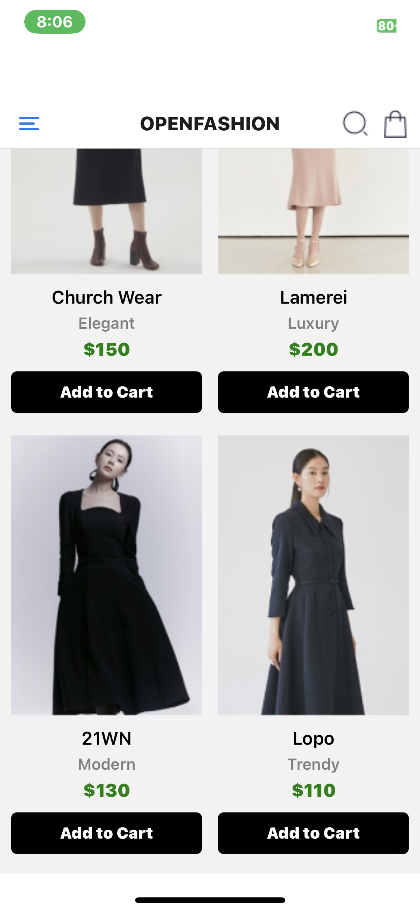
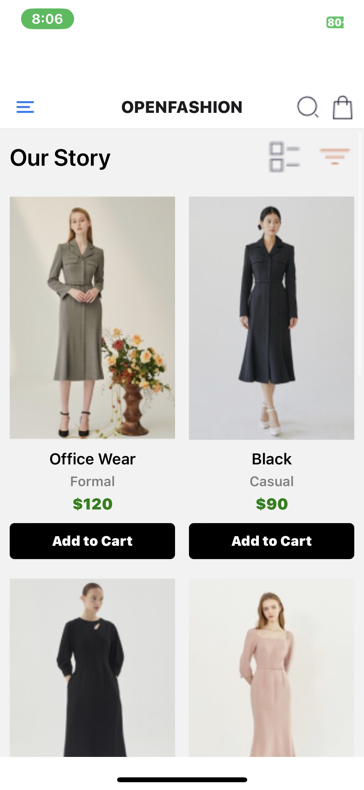

# rn-assignment6-11357227


# OpenFashion App

OpenFashion is a mobile application built with React Native for managing fashion products and shopping carts.

## Features

- View and add products to the cart.
- Navigate between different screens using a drawer navigation.
- Checkout functionality to review items in the cart.

## Screenshots





## Installation

1. Clone the repository:

   ```bash
   git clone https://github.com/yourusername/openfashion.git
   cd openfashion
   ```

2. Install dependencies:

   ```bash
   npm install
   ```

3. Run the application:

   ```bash
   npm start
   ```

   - Use Expo Go app on your Android or iOS device to scan the QR code and open the app.

## Technologies Used

- React Native
- React Navigation
- Expo CLI (for development and deployment)

## Folder Structure

```
openfashion/
├── App.js
├── components/
│   ├── CartScreen.js
│   ├── CustomHeaderButtons.js
│   └── HomeScreen.js
├── images/
│   ├── dress1.png
│   ├── dress2.png
│   └── ...
├── node_modules/
├── package.json
└── README.md
```

## Contributing

Contributions are welcome! Please fork the repository and create a pull request with your suggested changes.

---

### Notes:
 - Better time management